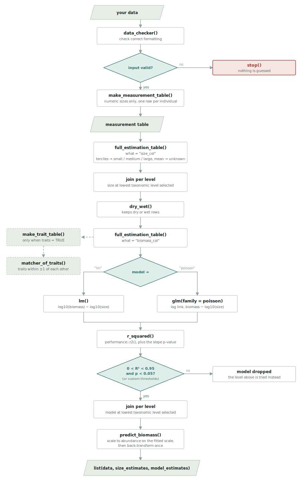

```{r include=FALSE}
knitr::opts_chunk$set(
  collapse = TRUE,
  comment = "#>",
  warning = FALSE,
  message = FALSE)
```
## Introduction to package use
Welcome to hellometry! This simple, lightweight package allows you to quickly
impute missing body size and body mass measurements in the supplied data frame (or tibble). The package uses existing measurements in your data to estimate the missing ones, so, essentially, the better the data supplied the better the estimation will be. It is compatible with any kind of data, provided you follow a few simple rules of column naming. These are as follow: <br>
- column with measurements needs to be called "size_col", and only accepts numerical measurements or "unknown", "small", "medium" or "large" as categorical values <br>
- column with development stage of specimens (larva/adult for instance) needs to be called "stage" <br>
- column with abundance of specimens needs to be called "abundance" <br>
- column with biomass of specimens needs to be called 'biomass_col'
- column with biomass type needs to be called 'biomass_type", and only accepts "dry" or "wet"

The idea of the package, wrapped in `hellometry()` is rather simple. First, a `measurement_table` is compiled from your own measurements. This table is then used to compute every possible size estimates, and allometric models with  `full_estimation_table()`. The `model` argument picks the kind of allometric model: `"lm"` (the default) fits a linear model on the log10-log10 scale, while `"poisson"` fits a Poisson glm with a log link. Models are kept only if $0 < R^2 < 0.95$ and $p$-value $< 0.05$, and discarded otherwise, unless you specify other values. The $R^2$ comes from `performance::r2()`. Note that size and models are not necessarily computed at the same scale, it all depends on model fit filtered by these $p$ and $R^2$ values! Finally, the size estimate and model at the lowest possible taxonomic level are joined back to the data, and used to estimate biomass at that particular row. The estimates are given with a confidence interval, i.e. the uncertainty around the mean predicted biomass, scaled to the abundance of the row.
`hellometry()` returns a list of three elements: 
- your data with estimated body sizes and biomasses, and column with information on the level at which were performed the estimation, 
- a tibble with all unique size estimates that were joined to your data, 
- a tibble with all unique allometric models that were joined to your data. <br>

The flowchart below traces one `hellometry()` call, from your data to the returned list.

```{r flowchart, echo=FALSE, out.width="100%", fig.alt="Flowchart of a hellometry() call, from the input data through data_checker(), make_measurement_table(), full_estimation_table() for sizes then models, and predict_biomass(), to the returned list of three tables."}

```


## Quick working example
The package estimates sizes and biomasses from the measurements you provide.
To illustrate, the package ships with two real datasets from Trinidadian bromeliad communities [(Rogy et al. 2024)](https://doi.org/10.1111/ele.14391): `bromeliad_inverts_measurements()`, a large set of invertebrate body size (head to tail, mm) and body mass (mg) measurements compiled by the authors, and `trini_communities()`, the taxa observed in a set of bromeliads for which we want size and biomass estimates. <br>
```{r}
# Load library
library(hellometry)

# We need to define a suite of levels to be used for estimation, i.e. columns in the data, 
# from lowest to coarsest resolution
level_vec  <-
  c("species", "genus", "family", "order")

# Read in the reference measurements, the real body sizes and body masses used to build the models
measurements <-
  bromeliad_inverts_measurements() %>%
  ## Rename columns to those expected by hellometry()
  dplyr::rename(size_col = body_size_mm,
                biomass_col = body_mass_mg,
                biomass_type = mass_type) %>%
  ## size_col holds both numbers and categories, so it must be character;
  ## biomass_col must be numeric for the allometric models
  dplyr::mutate(size_col = as.character(size_col),
                biomass_col = as.numeric(biomass_col))

# Have a look at the reference measurements
dplyr::glimpse(measurements)

# Read in the Trinidadian communities, the taxa we want size and biomass estimates for
communities <-
  trini_communities() %>%
  ## Rename the abundance column and add the columns hellometry() needs
  dplyr::rename(abundance = n) %>%
  ## Here we do not have any measurement for these invertebrates, so size is "unknown"
  ## and biomass NA, to be estimated. We use dry biomass because it tends to be more precise
  dplyr::mutate(size_col = "unknown",
                biomass_col = NA,
                biomass_type = "dry")

# Have a look at the communities to estimate
dplyr::glimpse(communities)

# Stack the reference measurements and the target communities into one table
my_invertebrates <-
  communities %>%
  dplyr::bind_rows(measurements)


# Now we can use the package to estimate sizes and biomasses!

# Get the estimates
my_invertebrates_estimated <-
  hellometry(dats = my_invertebrates, ## The data to be used
              level_vec  = level_vec , ## The taxonomic levels to be used
              biomass_type = "dry") ## Type of biomass to be estimated, "dry" or "wet"

# The result is a list of three elements
# - `data` - your data with estimated body sizes and biomasses, and column with 
# information on the level at which were performed the estimation. Note that 
# it also includes the measurements supplied so will need to filter out these rows
dplyr::glimpse(my_invertebrates_estimated$data)
# - `size_estimates` - a tibble with all unique size estimates that were joined to your data
dplyr::glimpse(my_invertebrates_estimated$size_estimates)
# - `model_estimates` - a tibble with all unique allometric models that were joined to your data
dplyr::glimpse(my_invertebrates_estimated$model_estimates)


# But now let's say you do not really want to do estimation on the data, 
# but just see the results of all possible estimations. Fear not, 
# it is easy!
## First compile the measurement table
measurement_table <-
  make_measurement_table(dats = my_invertebrates, ## The data to be used
                         level_vec  = level_vec) ## The taxonomic levels to be used
## Get all possible size estimates
size_estimation_table <-
  full_estimation_table(level_vec  = level_vec ,
                        measurement_table = measurement_table,
                        what = "size_col")
### Have a glimpse of it
dplyr::glimpse(size_estimation_table)

## Get all possible models
model_estimation_table <-
  full_estimation_table(level_vec  = level_vec ,
                        measurement_table = dry_wet(measurement_table,
                                                        biomass_type = "dry"), ## Filter for dry biomass
                        what = "biomass_col")
### Have a glimpse of it
dplyr::glimpse(model_estimation_table)

```

## Alternative to taxonomical grouping: fuzzy traits
Let's say that you do not have valid models that feels satisfying under a rather high taxonomic level (e.g. order). Here, one alternative would be to use traits instead of taxonomy to infer similarities between species. For example, two small, white, oblong, worm-like creatures have a high likelihood of having similar body masses if of the same body size.<br>
The package contains a function to help you do so. So far, they are not incorporated into the `hellometry()` main function, but can get you as far as `full_estimation_table()`. To use them, you would need to supply in `measurement_table` a set of columns that contain <b>[fuzzy]( https://doi.org/10.1111/j.1365-2427.1994.tb01742.x)</b> traits. The functions will only work with fuzzy traits with discrete integer values, and will group species with those that have trait values +/-1 those of the focus species. Here is one example, using the discrete (fuzzy) traits that ship with `trini_communities()`, derived from an [existing study](https://doi.org/10.1111/1365-2435.13141) and assigning them to the measured taxa by taxonomic similarity. The beginning of the code is a bit technical, but shows you an example of how to incorporate fuzzy traits to your data in order to use that aspect of the package.
```{r}

# Read in data with traits
trait_data <-
  trini_communities(traits = TRUE)

# The fuzzy traits are every column after the taxonomy, i.e. from the first trait
# column (AS1) up to the last column of the table
trait_columns <-
  trait_data %>%
  ## Get the block of trait columns ..
  dplyr::select(AS1:dplyr::last_col()) %>%
  ## Keep just their names
  names()

# Rebuild a measurement table, this time asking it to keep every taxonomic level we
# want to match on (make_measurement_table() only keeps the levels we give it)
measurement_table <-
  make_measurement_table(dats = my_invertebrates,
                         level_vec = c("species", "genus", "subfamily",
                                       "family", "order", "class"))

# Here we want to match traits from different morphospecies, look for matches 
# from genus up to class
match_levels <-
  c("genus", "subfamily", "family", "order", "class")

# Build a lookup holding one representative trait profile per taxon, at every level,
# stacked into a single long table that remembers the level each profile came from
trait_lookup <-
  match_levels %>%
  purrr::map_dfr(.,
                 ~ trait_data %>%
                     ## Drop the taxa that are unnamed at this level
                     dplyr::filter(!is.na(.data[[.x]]), .data[[.x]] != "") %>%
                     ## One row per taxon name, carrying its trait profile
                     dplyr::distinct(key = .data[[.x]],
                                     dplyr::across(dplyr::all_of(trait_columns))) %>%
                     ## Keep a single profile should a taxon appear more than once
                     dplyr::distinct(key, .keep_all = TRUE) %>%
                     ## Tag which taxonomic level this profile belongs to
                     dplyr::mutate(match_level = .x))

# Now hand each measured taxon the trait profile of its most similar relative, i.e.
# the profile found at the finest taxonomic level at which the taxon matches
trait_assignment <-
  measurement_table %>%
  ## Tag each measurement row so we can return its assigned traits later
  dplyr::mutate(.row = dplyr::row_number()) %>%
  ## Keep only that tag and the taxonomy columns we match on
  dplyr::select(.row, dplyr::all_of(match_levels)) %>%
  ## Stretch to one row per measured taxon per taxonomic level
  tidyr::pivot_longer(dplyr::all_of(match_levels),
                      names_to = "match_level", values_to = "key") %>%
  ## Drop the levels where the taxon has no name
  dplyr::filter(!is.na(key), key != "") %>%
  ## Attach every trait profile that matches, at whatever level
  dplyr::inner_join(trait_lookup, 
                    by = c("match_level", "key")) %>%
  ## Rank the levels from finest to coarsest, following match_levels
  dplyr::mutate(.priority = match(match_level, 
                                  match_levels)) %>%
  ## For each measurement row, keep only the finest matching level
  dplyr::group_by(.row) %>%
  dplyr::slice_min(.priority, 
                   n = 1, 
                   with_ties = FALSE) %>%
  dplyr::ungroup() %>%
  ## Return just the row tag and its assigned trait profile
  dplyr::select(.row, dplyr::all_of(trait_columns))

# Finally, join the assigned traits back onto the measurements, and keep only taxa
# that both received traits and are identified to family (our id_col below)
dats <-
  measurement_table %>%
  ## Recreate the same row tag to join on
  dplyr::mutate(.row = dplyr::row_number()) %>%
  ## Bring in each taxon's assigned trait profile
  dplyr::left_join(trait_assignment, by = ".row") %>%
  ## Drop the helper tag
  dplyr::select(-.row) %>%
  ## Keep taxa that got traits and have a family to identify them by
  dplyr::filter(!is.na(.data[[trait_columns[1]]]),
                !is.na(family), family != "")

## Get long format data of which taxa have similar traits
matched_traits <-
  matcher_of_traits(measurement_table = dats,
                    trait_columns = trait_columns,
                    id_col = "family") ## here taxa are identified by family
### See the output
head(matched_traits)

## Get clean list for full_estimation_table, includes matcher_of_traits()
## Here you can see which taxa were grouped together
clean_trait_list <-
  make_trait_table(measurement_table = dats,
                   trait_columns = trait_columns,
                   id_col = "family")
### See the output
clean_trait_list[[1]]

# The last two functions are called in full_estimation_table if you add the trait arguments
## Size estimation table
size_estimation_table_traits <-
  full_estimation_table(level_vec  = c(),
                        measurement_table = dats,
                        traits = TRUE, ## traits = TRUE
                        trait_columns = trait_columns, ## vector of fuzzy trait columns
                        id_col = "family", ## column identifying taxa
                        what = "size_col")
### See the output
head(size_estimation_table_traits)

## Model table
model_estimation_table_traits <-
  full_estimation_table(level_vec  = c(),
                        measurement_table = dry_wet(dats,
                                                    biomass_type = "dry"), ## Filter for dry biomass
                        traits = TRUE, ## traits = TRUE
                        trait_columns = trait_columns, ## vector of fuzzy trait columns
                        id_col = "family", ## column identifying taxa
                        what = "biomass_col")
### See the output
head(model_estimation_table_traits)
```
