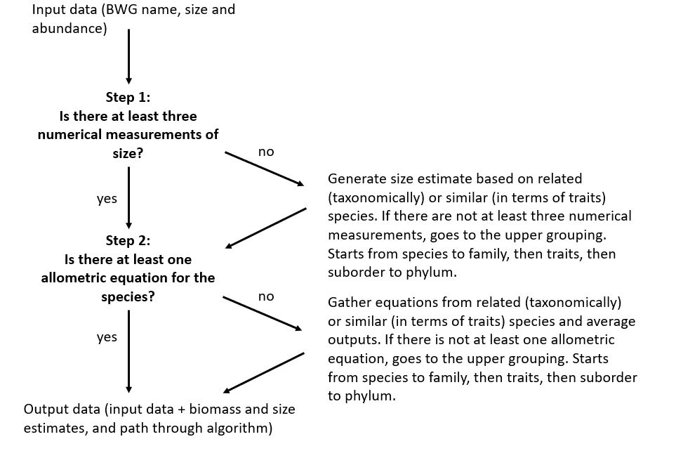

```{r include=FALSE}
knitr::opts_chunk$set(
  collapse = TRUE,
  comment = "#>",
  warning = FALSE, 
  message = FALSE) 
```
## Introduction to package use
<p align="center">

</p>

Welcome to hellometry! This simple, lightweight package allows you to quickly
estimate body size and biomass from any kind of data. Although originally 
developped for the Bromeliad Working Group (BWG) database, it is compatible with
any kind of data, provided you follow a few simple rules of column naming. These 
are as follow: <br>
- column with measurements needs to be called "size_mm", and only accepts numerical measurements or "unknown", "small", "medium" or "large" as categorical values <br>
- column with development stage of specimens (larva/pupa/adult) needs to be called "abundance" <br>
- column with abundance of specimens needs to be called "abundance" <br>
- column with biomass of specimens needs to be called 'biomass_mg'
- for BWG members, column with BWG names needs to be called "bwg_name" <br>
<br>
The idea of the package, wrapped in `hellometry()` is rather simple. First, a `measurement_table` is compiled, with your own measurements, and/or those provided 
by the BWG database, and/or some measurements collected by BWG members but not 
present in the database. This table is then used to compute every possible size estimations, and allometric model with  `full_estimation_table()`. Models are 
deleted if p > 0.05 or R2 > 0.95. Finally, the size estimation and model at the 
lowest possible taxonomic level are joined back to the data, and used to estimate 
biomass at that particular row. `hellometry()` returns a list of three elements:
your data with estimated body sizes and biomasses, and column with information
on the level at which were performed the estimations, a tibble with all unique
size estimations that were joined to your data, and a tibble with all unique
allometric models that were joined to your data.
<br>


## Quick working example 1 - : I have BWG-related data.
You will probably want to use built-in database and BWG measurements to increase
the precision of estimations. If you do not want to use these measurements, simply 
go to the second working example. <br>
If you want to use built-in measurements, you would first need to format your data. To quickly glance over the taxonomy present in the BWG database, you can use `get_bwgnames()`
```{r}
head(hellometry::get_bwgnames())
```

As you can see there are a lot of columns here, and all are needed for proper estimation. You can quickly add them to your data using the `add_taxonomy()` function, which is essentially a join of the data above to your data. If you have a species without bwg name, just put a random string or `NA` in the 'bwg_name' column. This function will leave rows without an actual BWG name empty.

```{r sup}
# Load library
library(hellometry)

# Get data without taxonomy
pitilla <-
  pitilla_data(taxonomy = FALSE)

# Check data
head(pitilla)
tail(pitilla)

# Add taxonomy
pitilla <-
  add_taxonomy(pitilla)

# Check data
head(pitilla)
tail(pitilla)

## Only the last few rows do not have a BWG name, their taxonomy needs to be entered manually

```

Now that you have entered the taxonomy you can finally use the main function of
the package `hellometry()`. 

```{r}
# Get data with taxonomy
pitilla <-
  pitilla_data() %>% 
  ## We need to specify whether we want data for the estimations to be "dry" or "wet", use "dry" as it tends to be more precise
  dplyr::mutate(biomass_type = "dry") %>% 
  ## We also need a column specifying biomass_mg, here just NAs
  dplyr::mutate(biomass_mg = NA)

# We need to define a suit of levels to be used for estimations
level_list <-
  c("bwg_name", "genus", "tribe", "subfamily", "family", "subord","ord", 
    "subclass", "class")

# Get the estimations
pitilla_bm <-
  hellometry(
    dats = pitilla, ## The data to be used
    level_list = level_list, ## The taxonomic levels to be used
    biomass_type = "dry", ## Type of biomass to be estimated, "dry" or "wet" 
    database = TRUE, ## Use database measurements
    nothing = FALSE) ## Use extra measurement taken by the BWG


# The result is a list of three elements
# - `dats` - your data with estimated body sizes and biomasses, and column with information on the level at which were performed the estimations
dplyr::glimpse(pitilla_bm$data)
# - `estimation_table` - a tibble with all unique size estimations that were joined to your data
dplyr::glimpse(pitilla_bm$size_estimations)
# - `model_table` - a tibble with all unique allometric models that were joined to your data
dplyr::glimpse(pitilla_bm$model_estimations)


# But now let's say you do not really want to do estimations on the data, but just see the results of all possible estimations. Fear not, it is easy!
## First compile the measurement table
measurement_table <- 
  make_measurement_table(dats = pitilla, 
                         level_list = level_list, 
                         database = TRUE, 
                         nothing = FALSE)
## Get all possible size estimations
size_estimation_table <- 
  full_estimation_table(level_list = level_list, 
                        measurement_table = measurement_table, 
                        what = "size_mm")
### Have a glimpse at it
dplyr::glimpse(size_estimation_table)

## Get all possible models
model_estimation_table <- 
  full_estimation_table(level_list = level_list, 
                        measurement_table = dry_wet(measurement_table,
                                                        biomass_type = "dry"), ## Filter for dry biomass
                        what = "biomass_mg")
### Have a glimpse at it
dplyr::glimpse(model_estimation_table)
```

## Quick working example 2 - : I have data not related to the BWG.
If you do not want to use the BWG database, you can still use the package,
but you will need to provide your own measurements. The package will then 
estimate sizes and biomasses based on these. <br>
```{r}
# Let's generate a random dataset of reptiles
set.seed(123) # For reproducibility

# Define orders, families, genera, and species
## Orders
orders <- 
  c("Squamata", "Testudines", "Crocodilia", "Rhynchocephalia")
## Families
families <- list(
  Squamata = c("Colubridae", "Viperidae", "Elapidae", "Scincidae"),
  Testudines = c("Testudinidae", "Emydidae", "Chelydridae"),
  Crocodilia = c("Crocodylidae", "Alligatoridae"),
  Rhynchocephalia = c("Sphenodontidae")
)
## Genera
genera <- list(
  Colubridae = c("Coluber", "Lampropeltis", "Pantherophis"),
  Viperidae = c("Crotalus", "Vipera"),
  Elapidae = c("Naja", "Bungarus"),
  Scincidae = c("Scincus", "Eumeces"),
  Testudinidae = c("Gopherus", "Aldabrachelys"),
  Emydidae = c("Trachemys", "Terrapene"),
  Chelydridae = c("Chelydra", "Macrochelys"),
  Crocodylidae = c("Crocodylus", "Osteolaemus"),
  Alligatoridae = c("Alligator", "Caiman"),
  Sphenodontidae = c("Tuatara")
)
## Species
species <- list(
  Coluber = c("Coluber constrictor", "Coluber viridiflavus"),
  Lampropeltis = c("Lampropeltis getula", "Lampropeltis triangulum"),
  Pantherophis = c("Pantherophis guttatus", "Pantherophis obsoletus"),
  Crotalus = c("Crotalus horridus", "Crotalus atrox"),
  Vipera = c("Vipera berus", "Vipera aspis"),
  Naja = c("Naja naja", "Naja pallida"),
  Bungarus = c("Bungarus caeruleus", "Bungarus multicinctus"),
  Scincus = c("Scincus scincus", "Scincus mitranus"),
  Eumeces = c("Eumeces schneideri", "Eumeces egregius"),
  Gopherus = c("Gopherus agassizii", "Gopherus polyphemus"),
  Aldabrachelys = c("Aldabrachelys gigantea"),
  Trachemys = c("Trachemys scripta", "Trachemys gaigeae"),
  Terrapene = c("Terrapene carolina", "Terrapene ornata"),
  Chelydra = c("Chelydra serpentina"),
  Macrochelys = c("Macrochelys temminckii"),
  Crocodylus = c("Crocodylus niloticus", "Crocodylus acutus"),
  Osteolaemus = c("Osteolaemus tetraspis"),
  Alligator = c("Alligator mississippiensis"),
  Caiman = c("Caiman crocodilus"),
  Tuatara = c("Sphenodon punctatus")
)

# Generate empty dataset
myreptiles <- 
  data.frame(order = character(), 
             family = character(), 
             genus = character(), 
             species = character(), 
             size_mm = numeric(), 
             biomass_mg = numeric(), 
             abundance = integer())


# Make loop to fill the dataset at random
## Keeping taxonomic consistency
for (order in orders) {
  for (family in families[[order]]) {
    for (genus in genera[[family]]) {
      for (spec in species[[genus]]) {
        # Generate at least 3 rows per species
        n_rows <- 
          sample(3:10, 1)
        # Create a temporary data frame for the current species
        temp <- data.frame(
          order = order,
          family = family,
          genus = genus,
          species = spec,
          # Generate random size and biomass values
          size_mm = round(rnorm(n_rows, mean = runif(1, 50, 500), sd = 30), 1),
          biomass_mg = round(rnorm(n_rows, mean = runif(1, 100, 5000), sd = 100), 1),
          # Generate random abundance values
           abundance = sample(1:10, n_rows, replace = TRUE))
        ## Add the temporary data to the main dataset
        myreptiles <- 
          dplyr::bind_rows(myreptiles, 
                           temp)}}}}

# Have a look at the data
dplyr::glimpse(myreptiles)

# Now make a random half "unknown" and NA to estimate
## Determine the number of rows to turn into NA
num_na <- 
  floor(nrow(myreptiles) / 2)
# Randomly select rows to have modified values in size_mm and biomass_mg
na_rows <- 
  sample(1:nrow(myreptiles), num_na)
## Assign new values to the selected rows in the specified columns
myreptiles$size_mm[na_rows] <- 
  "unknown"
myreptiles$biomass_mg[na_rows] <- 
  NA
## Now we should see altered values
dplyr::glimpse(myreptiles)


# Now we can use the package to estimate sizes and biomasses!

# We need to define a suit of levels to be used for estimations, a.k.a. columns in the data
level_list <-
  c("species", "genus", "family", "order")

# The data also need to include a biomass_type (dry/wet) column, here use dry because it tends to be more precise, and a stage column for organisms with very different life stages, here put adult because it does not really matter
myreptiles <- 
  myreptiles %>% 
  dplyr::mutate(biomass_type = "dry") %>% 
  dplyr::mutate(stage = "adult")

# Get the estimations
myreptiles_estimated <- 
  hellometry(dats = myreptiles, ## The data to be used
              level_list = level_list, ## The taxonomic levels to be used
              biomass_type = "dry", ## Type of biomass to be estimated, "dry" or "wet" 
              database = FALSE, ## Do not use database measurements
              nothing = TRUE) ## Do not use extra measurement taken by the BWG

# The result is a list of three elements
# - `dats` - your data with estimated body sizes and biomasses, and column with information on the level at which were performed the estimations
dplyr::glimpse(myreptiles_estimated$data)
# - `estimation_table` - a tibble with all unique size estimations that were joined to your data
dplyr::glimpse(myreptiles_estimated$size_estimations)
# - `model_table` - a tibble with all unique allometric models that were joined to your data
dplyr::glimpse(myreptiles_estimated$model_estimations)


# But now let's say you do not really want to do estimations on the data, but just see the results of all possible estimations. Fear not, it is easy!
## First compile the measurement table
measurement_table <- 
  make_measurement_table(dats = myreptiles, ## The data to be used
                         level_list = level_list, ## The taxonomic levels to be used
                         database = FALSE, ## Do not use database measurements
                         nothing = TRUE) ## Do not use extra measurement taken by the BWG
## Get all possible size estimations
size_estimation_table <- 
  full_estimation_table(level_list = level_list, 
                        measurement_table = measurement_table, 
                        what = "size_mm")
### Have a glimpse at it
dplyr::glimpse(size_estimation_table)

## Get all possible models
### Note that the package filters out models wiht p >0.05 and R2 > 0.95 to not include overfitted models
model_estimation_table <- 
  full_estimation_table(level_list = level_list, 
                        measurement_table = dry_wet(measurement_table,
                                                        biomass_type = "dry"), ## Filter for dry biomass
                        what = "biomass_mg")
### Have a glimpse at it
dplyr::glimpse(model_estimation_table)

```

