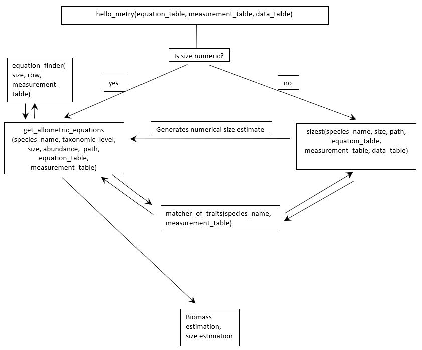

```{r, include = FALSE}
knitr::opts_chunk$set(
  collapse = TRUE,
  comment = "#>",
  warning = FALSE, 
  message = FALSE) 
```
## Introduction to package use
<p align="center">

</p>

The package consists of an algorithm that proceeds in two steps. In Step 1, the algorithm assesses if there is a numerical measurement of size present  for biomass estimation. If there is no numerical measurement, the algorithm  can use categorical measurements (“unknown”, “small”, “medium” or “large) to generate a size estimate based on existing measurements from  the species of interest, or species that are either taxonomically related, or  have a very close trait distribution. In Step 2, the algorithm will assess if an  allometric equation is present for the species of interest, in order to estimate biomass from size. Similarly to Step 1, if there is no equations for the species of interest, the algorithm will gather equations from similar species (either in terms of taxonomy or traits) and average the output of each equation. The output consists of the original data, to which are added a column consisting  of the biomass estimate, one of the size estimate (NA if no estimation) and another consisting of the path taken through  the algorithm (which kind of estimations were performed, if these were performed at a taxonomic or trait level, how many measurements/equations were used in the estimation).
The data requirements of the package are as follow: <br>
- column with BWG names needs to be called "bwg_name", <br>
- column with measurements needs to be called "size_mm", and only accepts "unknown", "small", "medium" or "large" as categorical values <br>
- column with abundance of specimens needs to be called "abundance" <br>

## Inner workings of the algorithm
The following figures shows how the different functions of this package are sequentially called to estimate size and biomass in an entire dataframe. They can all be used in isolation.
<p align="center">

</p>

## Quick working example
```{r}
# Load library
library(hellometry)

# Get practice data
pitilla <- 
  pitilla_data()

# Check data
head(pitilla)

# Get biomass estimates
pitilla <- 
  hello_metry(pitilla, ## the data
              print = F, ## I don't want to see how fast the functions moves through the data
              biomass_kind = "both", ## I want both dry and wet biomasses (wet is more precise for odonates)
              database = TRUE) ## since this data is not in the BWG database, I can safely include measurements from there

# Look at biomass estimates
head(pitilla)


# We now have biomass estimates, we can then summarise them easily with another function
results <- 
  chart_path(pitilla)

# Examine its results
results
```

